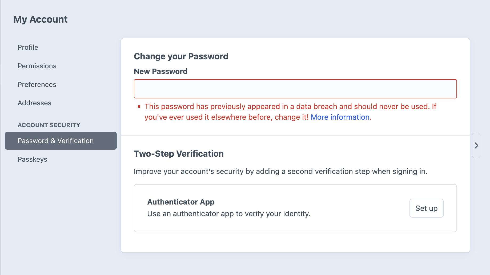

# Pwny plugin for Craft CMS

Enhance your site's security by ensuring users select stronger passwords than `password`. The plugin employs the k-Anonymity method to validate passwords against the Pwned Passwords API without compromising user privacy by revealing passwords to an external service.

This plugin was inspired by the Cloudflare blog post [Validating Leaked Passwords with k-Anonymity](https://blog.cloudflare.com/validating-leaked-passwords-with-k-anonymity/) and this one by [Troy Hunt](https://www.troyhunt.com/ive-just-launched-pwned-passwords-version-2/) creator of the [Have I Been Pwnd](https://haveibeenpwned.com/?ref=troyhunt.com) service.



## Requirements

This plugin requires Craft CMS `5.3.0` or later.

The plugin needs to make a call to the free [Have I Been Pwnd API](https://haveibeenpwned.com/API/v3#SearchingPwnedPasswordsByRange) at the address `https://api.pwnedpasswords.com/` in case you need to whitelist this on your host.

## Installation

To install the plugin, follow these instructions:

```
composer require "simplygoodwork/craft-pwny:^1.0.0" -w && php craft plugin/install pwny
```

for DDEV users:

```
ddev composer require "simplygoodwork/craft-pwny:^1.0.0" -w && ddev craft plugin/install pwny
```

## Settings

You can toggle the service, restrict to just users with CP access and customise the error message.


If you want to toggle the plugin on/off using environment variables, you could create a `config/pwny.php` file to override this setting. 
The example below uses `PWNY_ENABLED` in `.env` but defaults to `true` (on) if the variable can't be found:

```php
<?php

use craft\helpers\App;

return [
	'enabled' => App::env('PWNY_ENABLED') ? App::env('PWNY_ENABLED') : true,
];

```

---

Brought to you by [Good Work](https://simplygoodwork.com).
